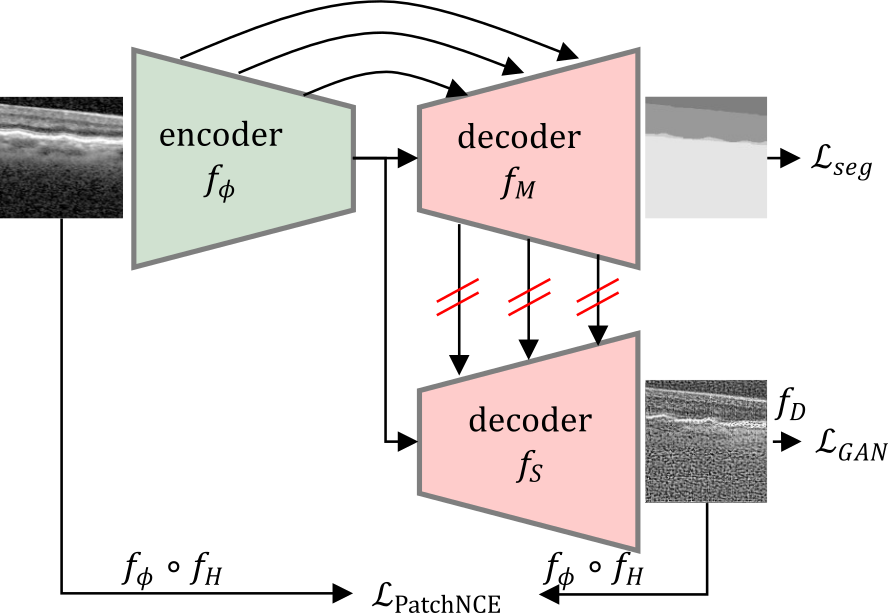

# Anatomically Conditioned Contrastive Unpaired Translation (ACCUT)


We provide our extension "Anatomically Conditioned Contrastive Unpaired Translation" to the "Contrastive Learning for Unpaired Image-to-Image Translation" by Park et al. It adds a segmentation decoder which passes features to the style decoder and thereby stresses semantic information. This work will be presented at ISBI 2024.


### Network architecture


## Example Results


#### Preprocessing of input images


### Citation
If you use this code for your research, please cite our [paper](https://arxiv.org/pdf/2007.15651).
```

```

If you use the original [CUT](https://arxiv.org/pdf/2007.15651), [pix2pix](https://phillipi.github.io/pix2pix/) and [CycleGAN](https://junyanz.github.io/CycleGAN/) model included in this repo, please cite the following papers
```
@inproceedings{park2020cut,
  title={Contrastive Learning for Unpaired Image-to-Image Translation},
  author={Taesung Park and Alexei A. Efros and Richard Zhang and Jun-Yan Zhu},
  booktitle={European Conference on Computer Vision},
  year={2020}
}


@inproceedings{CycleGAN2017,
  title={Unpaired Image-to-Image Translation using Cycle-Consistent Adversarial Networks},
  author={Zhu, Jun-Yan and Park, Taesung and Isola, Phillip and Efros, Alexei A},
  booktitle={IEEE International Conference on Computer Vision (ICCV)},
  year={2017}
}


@inproceedings{isola2017image,
  title={Image-to-Image Translation with Conditional Adversarial Networks},
  author={Isola, Phillip and Zhu, Jun-Yan and Zhou, Tinghui and Efros, Alexei A},
  booktitle={IEEE Conference on Computer Vision and Pattern Recognition (CVPR)},
  year={2017}
}
```


### Acknowledgments
 Our code is developed based on [contrastive-unpaired-translation](https://github.com/taesungp/contrastive-unpaired-translation). 